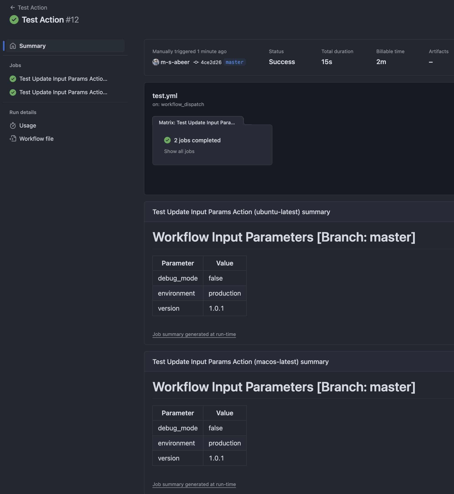

# Update GHA Input Params in Summary

A GitHub Action that automatically creates a formatted table of all workflow_dispatch input parameters in your workflow summary.

## Features

- Automatically captures and displays all workflow_dispatch input parameters
- Creates a clean, formatted table in the workflow summary
- Supports all input types (string, boolean, choice, etc.)
- No configuration needed - works out of the box
- Lightweight - uses only bash and jq
- Supported on both ubuntu-latest and macos-latest

## Requirements

- The workflow must be triggered via `workflow_dispatch`
- The runner must have `jq` installed (most GitHub-hosted runners have this by default)

## Usage

1. Add this action to your workflow that uses `workflow_dispatch`:

```yaml
name: My Workflow
on:
  workflow_dispatch:
    inputs:
      environment:
        description: 'Environment to deploy to'
        required: true
        type: choice
        options:
          - staging
          - production
      debug_mode:
        description: 'Enable debug mode'
        type: boolean
        default: false
      version:
        description: 'Version to deploy'
        required: false
        type: string

jobs:
  deploy:
    runs-on: ubuntu-latest
    steps:
      - uses: msabeer/update-gha-input-params-in-summary@master
```

The action will automatically create a table in your workflow summary containing all workflow_dispatch input parameters and their values.

## Example Output

When the workflow is triggered with inputs, you'll see a table like this in your workflow summary:

| Parameter | Value |
|-----------|-------|
| debug | false |
| environment | staging |
| version | 1.0.0 |

Here's a screenshot from a test run:



## License

MIT

## Contributing

Contributions are welcome! Please feel free to submit a Pull Request.
